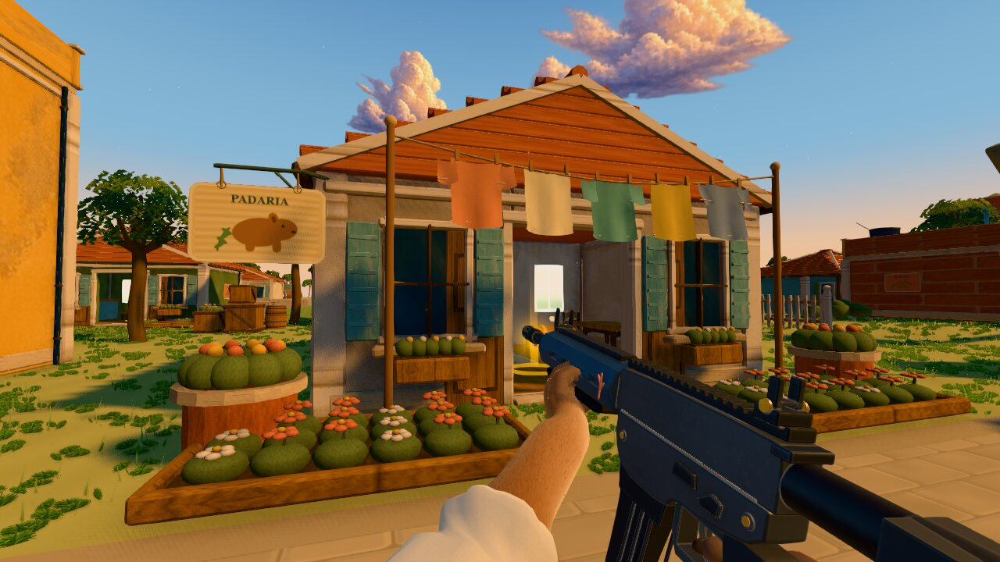
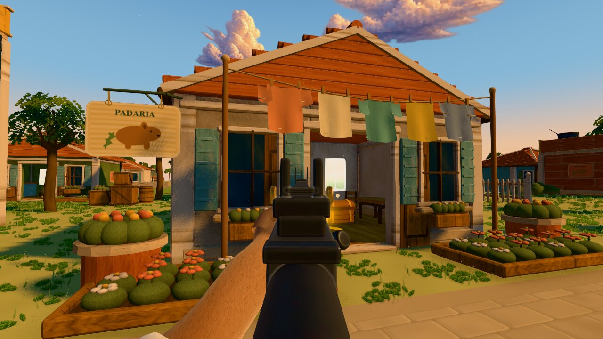
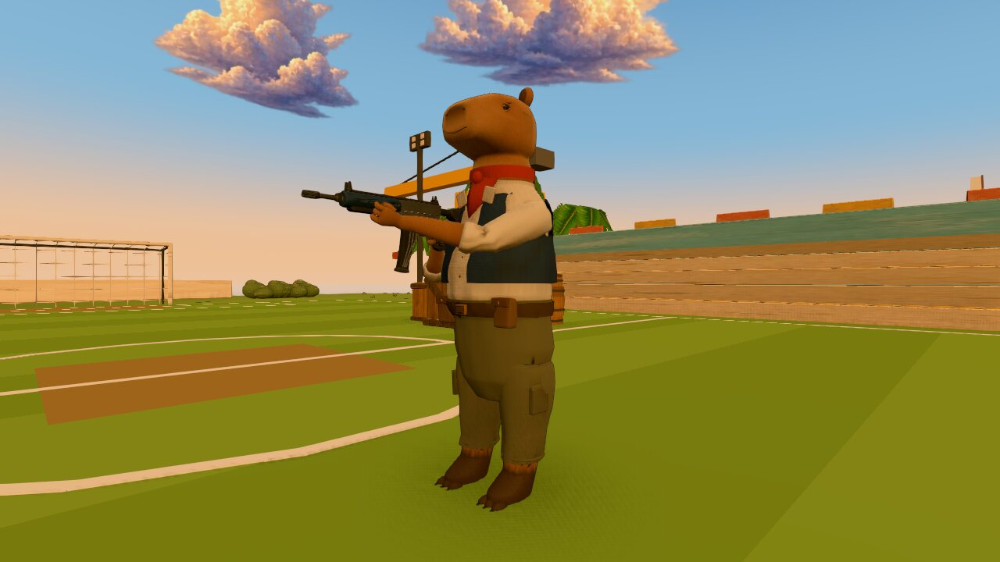
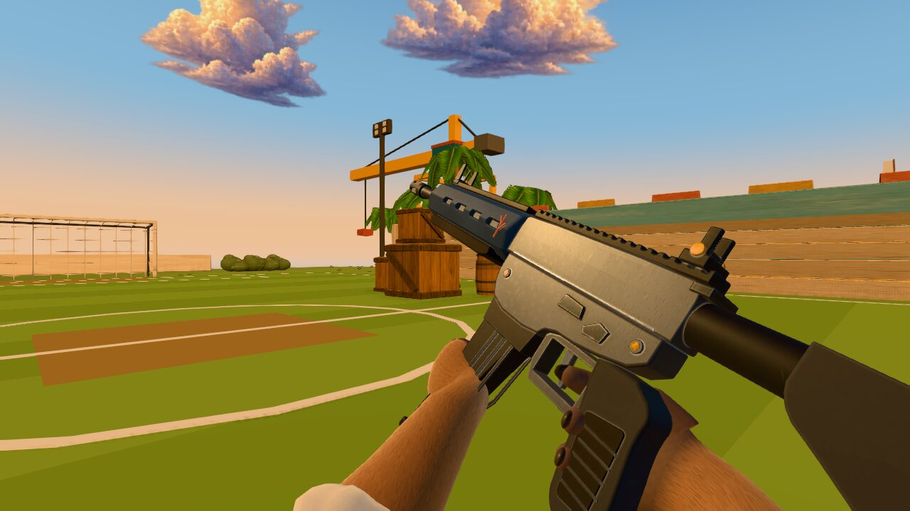

# Character, paws, M4 and aiming benchmark

Ported into `overhaul/aaa-autonomous` on 2026-09-28 from the isolated clone (branch `isolated/daytime-work`) as the base of the guns, holding and character pass; see `docs/overhaul/autonomous-progress.md` section I. Images are JPEG copies of the original PNGs.

This local experiment replaces the player character and first-person paws, redesigns the M4, and makes M4 aiming wider and more responsive. The second pass reshapes the head and body, joins the wrists, adds forearm twist joints, exposes the trigger and coordinates magazine handling. The working assumption is one character/M4 benchmark, with compatible grips for the other nine weapons. Success means stable articulated paws, readable anatomy and sights, preserved gameplay contracts, and a result judged in the actual renderer.

Work is confined to `/Users/lucas_gaspe/dev/ultima-capivara-isolated`, branch `isolated/daytime-work`, based on `71c3902a6d0b717976fba787c0a273d1750fc4c8`. This clone has its own `.git` and no remotes. The original repository, paused agent, conversation, memory and schedule were not modified. Nothing has been published or integrated.

## Review the running result

- [Play the isolated build](http://127.0.0.1:5273/): enter practice; right mouse aims, R reloads, I inspects under the default bindings.
- [Character holding the M4](http://127.0.0.1:5273/tools/blender/review.html?clean&distance=2.2&angle=left&color=%23D87860&weapon=m4&x=84&z=-58).
- [Character face](http://127.0.0.1:5273/tools/blender/review.html?clean&head&distance=0.7&angle=left&color=%23D87860&x=84&z=-58).

The screenshots below are the real game renderer. Generated concept images are stored separately and should be judged as art direction.

| M4 hip view | M4 aimed view |
| --- | --- |
|  |  |

| Character | Reload grip |
| --- | --- |
|  |  |

Baseline captures: [old hip view](captures/before-fp-m4.jpg), [old aim](captures/before-ads-m4.jpg), [old character and paws](captures/before-capyFront.jpg). More captures cover the [face](captures/character-head.jpg), [back](captures/character-back.jpg), [run](captures/character-run-0.45.jpg), [crouch](captures/character-crouch-0.4.jpg), [third-person reload](captures/character-reload-1.7.jpg), and forced [LOD1](captures/character-lod1.jpg)/[LOD2](captures/character-lod2.jpg) at close range for inspection. Far LOD intentionally omits small facial and finger details.

Reload recordings (empty, partial, 35% speed, third person) were not committed; they are kept locally in `output/iso/recordings/`.

Detail checks: [trigger and wrist from the side](captures/m4-trigger-wrist.jpg), [freefall](captures/character-freefall.jpg), [parachute](captures/character-parachute.jpg), [untextured form](captures/character-clay.jpg).

## Aiming research and decisions

There is no single wide-aiming standard across shooters. Activision documents an **Affected ADS FOV** mode that preserves more peripheral vision and a **Relative** mouse mode that relates aiming movement to screen space. Battlefield also exposes ADS FOV relative to the selected field of view and uniform aiming. These primary sources support separating world magnification, weapon framing and mouse response:

- [Call of Duty: Black Ops Cold War PC controls and settings](https://www.callofduty.com/au/en/blog/2020/11/Black-Ops-Cold-War-Controls-and-Settings-PC).
- [Battlefield 2042 PC display settings](https://www.ea.com/able/resources/battlefield-2042/pc/display).
- [Battlefield 2042 update 5.0: ADS FOV and uniform aiming](https://www.ea.com/en-gb/games/battlefield/battlefield-2042/news/battlefield-2042-update-notes-5-0).

The implementation is our design choice informed by those settings:

- M4 uses mild **1.15× optical zoom**, calculated from the tangent of the selected FOV. At the default 100° horizontal field of view on 16:9, ADS is approximately **92.05°**. Tests cover 80°, 100° and 120° settings.
- Its weapon camera uses an independent **64° vertical FOV**. The rear stock stays below the sight picture; thin open irons replace the thick ring. These dimensions were tuned in the running renderer.
- Mouse sensitivity follows the **rendered** FOV tangent ratio, including transitions, so movement near the reticle stays consistent. The old immediate 0.55 sensitivity multiplier is removed. At full M4 aim the scale is approximately 0.87.
- The existing 0.22-second M4 ADS transition, recoil, firing and reload timings remain. Camera FOV no longer adds a second damping stage. The existing renderer order still consumes the preceding frame's viewmodel ADS amount.
- Scoped weapons keep their existing magnification. The FOV-based mouse response applies across weapons.

This is a tested aiming implementation; whether its feel is the preferred one still benefits from Lucas's hands-on playtest. Automated checks establish framing and consistency, not subjective fun.

## Character and weapon direction

Primary anatomy reference: [San Diego Zoo capybara](https://zoo.sandiegozoo.org/animals/capybara). Fur/clothing separation and expressive animal proportions were studied from [Insomniac's Rivet reveal](https://blog.playstation.com/2021/04/26/meet-rivet-the-mysterious-new-protagonist-in-ratchet--clank-rift-apart/) and [Damon Cimarusti's character work](https://damoncimarusti.artstation.com/projects/48nYJ8). Weapon material hierarchy reference: [Kermit Barrette's rifle artwork](https://kermitbarrette.artstation.com/projects/xJRNe1). No third-party game art was imported as a runtime asset.

The [user-provided rifle](rifle-source-reference.jpg) defines the navy handguard, dark receiver, brass hardware, teal stock mark and coral emblem. Generated studies: [character turnaround](character-design.jpg), [holding poses](holding-reference.jpg), [initial POV board](pov-reference.jpg), [wide aiming study](wide-aim-reference.jpg). The initial POV board contains digit-count and framing mistakes; the runtime geometry follows three fingers plus one thumb. Prompts are preserved in [character prompts](prompts.md) and [weapon/POV prompts](weapon-prompts.md).

The runtime model has short chestnut fur, an ivory rolled-sleeve shirt, navy vest, olive cropped trousers, compact belt pouches and team-tinted scarf. Shared UV detail, normal and roughness/metalness maps distinguish fur, paw pads, woven cloth, leather, eyes, nails and hardware. Sparse opaque fur tufts add silhouette detail without transparent fur shells. The result retains the game's stylized proportions and existing animation system; it is not a sculpted reproduction of the generated concept.

The second sculpt uses authored cross-sections and a voxel union instead of inflating metaballs and projecting the result onto collision primitives. Shoulders, belly, waist, pelvis and legs have distinct profiles. The head has a broad blunt muzzle, cheek and jaw shape, smaller fitted eyes/lids and thicker ears. The existing collision envelope is validated without changing the geometry. Hidden body faces beneath opaque clothing are removed to prevent poke-through and avoid spending geometry on invisible surfaces. Cargo flaps follow their own thigh; the leg solver reads actual bone lengths to preserve foot contact. A broad hip-weight transition prevents the trouser surface inverting during crouch, and horizontal garment hems retain their authored height.

Forearm and palm now share a 32-vertex wrist loop, without an internal cap. Both rigs have one extra twist joint per forearm, with roll distributed across two joints to avoid collapsing linear skinning. The M4 support grip follows the forearm more naturally. Quantization scale is stripped from third-person bind matrices before extracting rotations; leaving that scale in the quaternion caused wrist offsets even with correct targets.

## Reload direction and implementation

Primary references: [Infinity Ward's animation and authenticity discussion](https://blog.activision.com/call-of-duty/2019-07/Modern-Warfare-Initial-Intel-Detailing-Advancements-in-Animation-and-Authenticity), [Bungie's first-person animation talk overview](https://gdcvault.com/play/1022297/The-Art-of-First-Person), and [Allan Zhang's MK18 animation portfolio](https://spacepirate.artstation.com/projects/k4dydy). The Activision article describes weapon weight, continuous magazine handling, different empty/tactical sequences and synchronized audio. The GDC overview supports responsiveness within gameplay constraints. The portfolio was a source lead; its embedded video was unavailable and is not claimed as a watched reference.

The selected feel is snappy and weighted, with restrained camera movement. The authoritative M4 reload stays **2.5 seconds** and ammunition still changes only on completion. Empty/partial state is captured locally at reload start; no network field was added.

| Time | Action |
| --- | --- |
| 0–0.30 s | Lift/cant and leave the handguard |
| 0.30–0.75 s | Contact, release and extract the magazine |
| 0.75–1.25 s | Move out of view and retrieve the replacement |
| 1.25–1.75 s | Align, insert and seat with a brief weapon impulse |
| 1.75–2.10 s | Empty: operate bolt release; partial: regrip |
| 2.10–2.50 s | Settle ready; held ADS resumes after completion |

Hand keys can refer to a named part, including its full rotation. The magazine and contact paw therefore share one transform through removal and insertion. The old/fresh swap happens below the view. M4 carrier motion is linear, separate from the sniper's rotating bolt. Nearby held M4s have a separate magazine; distant and ground models remain combined. Third person shares the contact phases with shorter travel toward the belt. Existing Foley fires once at each mechanical beat. Cancel, switch and death restore parts.

## Implementation and handoff boundaries

| Area | Files and reason |
| --- | --- |
| Shared anatomy and surfaces | `tools/blender/capy_paw.py`, `character_surfaces.py`: four-digit geometry, explicit skin ownership, shared surface atlas. Finger vertices cannot blend onto another digit. |
| Character | `capybara_v4.py`, `capybara_clips.py`, `character_emotes.py`, `build-characters.mjs`, character GLB/metrics: anatomy, outfit, face, fur and articulated paws; 24 finger joints and two twist joints added while retaining the original 35 joints and all 25 clips. The statue is unchanged. |
| First-person arms | `fp_arms.py`, `build-fp.mjs`, FP GLB/metrics, `src/render/fp-arms.ts`: matching anatomy, sleeve construction, corrected wrist roll and wrist skin transition. |
| M4 | `arsenal.py`, `arsenal_lib.py`, M4 GLB/metrics, `build-world-arsenal.mjs`, world data and atlas: new silhouette, PBR finish, readable sights and existing animated parts/sockets. |
| Runtime materials and grips | `materials.ts`, `capybara.ts`, `viewmodel-specs.ts`, `weapons.ts`: preserve imported maps, share finger articulation, fit wrists to each weapon, move the third-person rifle clear of the torso. |
| Reload and world parts | `viewmodel-choreo.ts`, `viewmodel-anims.ts`, `weapons.ts`, `capybara.ts`, `avatars.ts`, `world-weapons.ts`: named-part contacts, empty/partial sequencing, linear M4 carrier and separate nearby magazine. |
| Aiming | `camera.ts`, `input.ts`, `main.ts`: mild M4 zoom and FOV-relative mouse movement. |
| Review and checks | `tools/blender/review.ts`, focused asset/loading/input/camera/viewmodel tests, new `tests/paw-asset.test.ts`. |

Import the character/FP GLBs together with their rig, material and grip code. Import M4 geometry together with its sight specification and regenerated world representation. The camera/input change can be reviewed independently. Any later integration should reconcile against the other agent's current work; it should not overwrite that work wholesale.

The other nine weapon GLBs, their world geometry and metadata are byte-for-byte unchanged. Decoded atlas pixels outside the M4 cell are unchanged. [Scope verification](asset-scope-verification.json) records those checks. Shared simulation, damage, recoil definitions, collision and networking were not edited.

## Asset budget

| Asset | Before triangles | After triangles | Before bytes | After bytes |
| --- | ---: | ---: | ---: | ---: |
| Character LOD0 / LOD1 / LOD2 | 38,250 / 7,997 / 2,198 | 39,814 / 9,799 / 2,443 | 715,112 | 4,483,244 |
| Both first-person arms | 8,432 | 7,264 | 64,096 | 3,053,840 |
| First-person M4 | 10,980 | 20,960 | 331,260 | 1,060,948 |
| World weapon atlas | n/a | n/a | 122,778 | 569,754 |

World M4 remains 2,400 triangles near / 412 far. Articulated nearby M4s use a 2,000-triangle body and 400-triangle magazine. Character uses one material and three 2048² maps; the FP arms have their own embedded copy of the surface maps. The four changed GLB/atlas assets total **9,167,786 bytes (8.74 MiB)**, an increase of **7,934,540 bytes (7.57 MiB)** over the original. The guardrails are 50k/10k/2.5k character LODs, 12k both FP arms, 28k M4 and 10 MiB combined files. These protect frame time, memory and loading; they are not quality targets. Removing hidden body surfaces brought the final character below 40k while preserving its visible detail. The targeted world-atlas rebuild uses lossless WebP to preserve all untouched cells.

## Verification

- Full unit suite: **95 files, 718 tests passed** with two workers.
- Tests cover exported wrist continuity/no internal caps, four-digit ownership, trigger/magazine clearance, planted feet, original clips/hitboxes, actual-rig third-person magazine contact, empty/partial reloads at 30/60/120 FPS, movement/reduced motion, consecutive reloads, cancellation/switch/death, Foley order, authoritative ammunition timing and return to ADS.
- Production TypeScript/Vite build passed. Vite's existing large-chunk warning remains.
- Real-renderer inspection: all ten weapon hip grips; M4 ADS and reload phases; character head/body, crouch, freefall and parachute; normal and slow reload recordings. First-pass captures additionally cover firing, sprint, landing, inspect, walk/run/jump/hit and all LODs.
- Skin checks cover four digits, finger ownership, normalized weights and close-LOD retention. Existing hitbox, animation, ADS-alignment and reload checks remain active.

The [performance report](performance.md) and [raw measurements](performance.json) record the rendered 16-character scene at 1280×720 on this Apple M2 / Chrome 154 / Metal machine. All three presets averaged **60 FPS**, with **16.7–16.8 ms p95** and zero frames over 50 ms in each five-second sample. Total same-origin response bodies through match loading were approximately **26.00 MiB**. This is a short local scene measurement, not a claim about every map view or multiplayer session.

The stock performance harness's five-second loading expectation timed out twice before measuring frames; the successful measurement run allowed 30 seconds for loading through an ignored local config (`output/perf-benchmark.config.ts`). Production code and the tracked test configuration were unchanged. Thus the frame-rate measurement passed, but the original five-second loading gate did not.

Two [fresh-context loading measurements](loading.json) on the production preview took **6.94 and 18.10 seconds from Practice to ready** on the high preset. The final-assets sample reached the menu in 0.96 seconds and the match in 7.90 seconds total; the earlier sample preceded the last hip/hem refinement. The local network was unthrottled, the GPU driver was warm, and browser-process/driver caches were not cleared. These are not cold-machine measurements, and the variation cannot be attributed to the small final asset edits. Loading remains a weakness; no comparable original-build measurement was taken, so this does not isolate the cost of the new assets.

## Reproduce locally

Run from the independent clone with Node 24 and Blender installed. Dependencies are already installed here.

```sh
fnm exec --using 24 node tools/blender/build-characters.mjs --character-only
fnm exec --using 24 node tools/blender/build-fp.mjs arms m4
fnm exec --using 24 node tools/blender/build-world-arsenal.mjs m4
fnm exec --using 24 npm test -- --maxWorkers=2
fnm exec --using 24 npm run build
fnm exec --using 24 env VITE_QA=1 npm run dev -- --port 5273
```

`--character-only` deliberately skips the unrelated statue. The targeted weapon builders preserve other weapons' metadata and atlas cells. `BLENDER_BIN` can override the default macOS Blender path.
