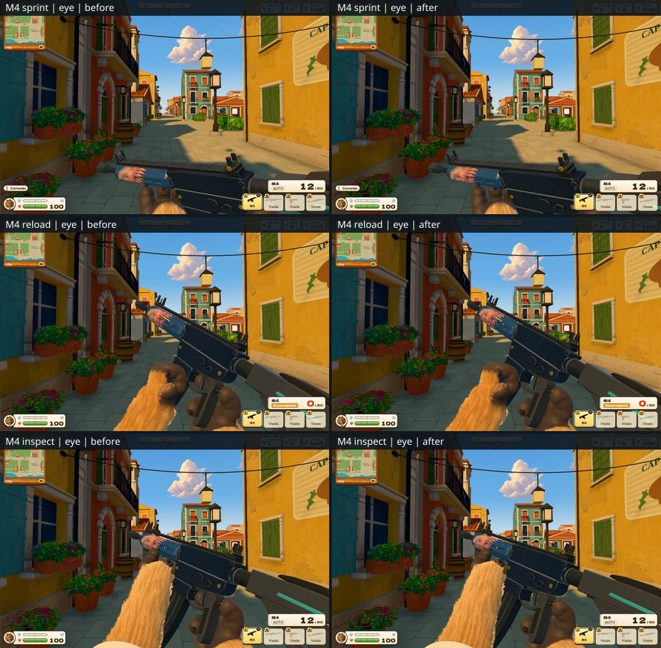
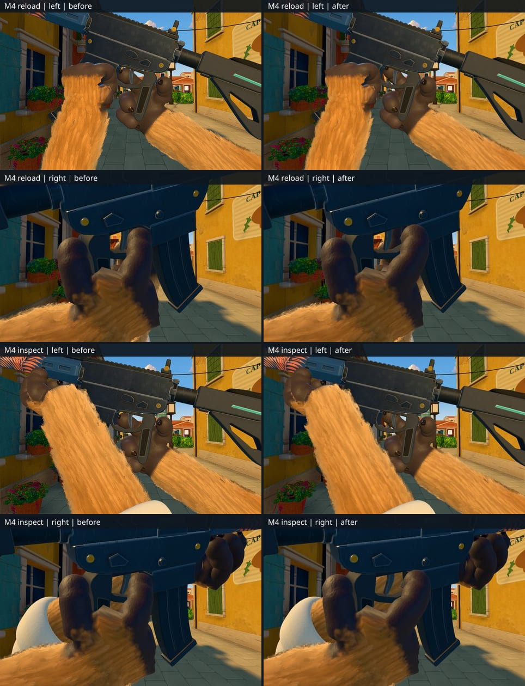
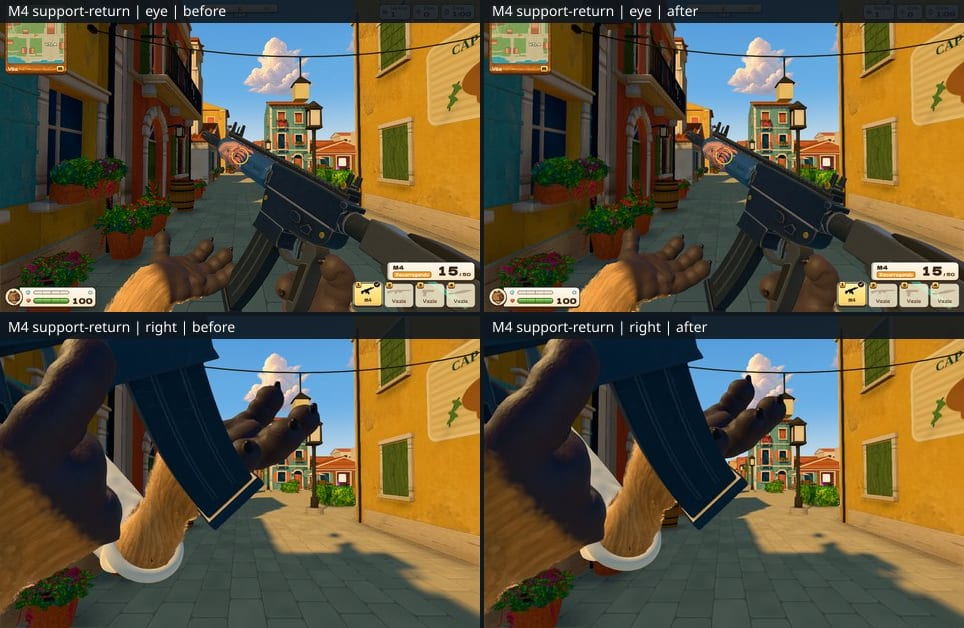

# M4 first-person holding fixes

The M4 now withdraws its trigger digit through an 11-pose measured route during
sprint, reload, draw, holster and inspect, then returns along the same route.
The previous carry pose retained the ready index inside the trigger guard.
The route ends beside the receiver with the distal pad restored to its default
shape. The firing-paw palm, wrist orientation, wrapping digits and ready/fired
grips are unchanged, as are weapon geometry, livery, framing and settings.

The narrow passage uses the existing bounded 4% radial distal-pad compression.
Compression ramps from 1 to 0.96 before withdrawal, then back to 1 at the
receiver; the reverse applies during return. Longitudinal digit length stays
unchanged. The route was truncated before the search's distant straight-digit
goal so the final pad rests against the receiver.

All distances below are millimetres, measured against the actual posed skin
and weapon triangles using unmodified `measureGrip` and `holdingMetrics`.

| State | Before: index vertices inside guard | After: index vertices inside guard | After: whole firing-paw minimum | After: trigger front distance |
| --- | ---: | ---: | ---: | ---: |
| Hip ready | 119 | 119 | -0.444 | 0.438 |
| Fired ready | 124 | 124 | -0.249 | 0.500 |
| Sprint, 0.6 s | 119 | 0 | -0.257 | Not a firing state |
| Empty reload, 0.45 s | 119 | 0 | -0.249 | Not a firing state |
| Partial reload, 1.2 s | 119 | 0 | -0.249 | Not a firing state |
| Inspect, 0.55 s | 119 | 0 | -0.249 | Not a firing state |
| Inspect returned, 1.81 s | 119 | 119 | -0.444 | 0.438 |

The occupancy test measures all 569 index skin vertices, including blended
knuckle vertices. A negative control proves that an outside distal centroid
can still leave part of the digit inside the guard. At the fully indexed
endpoint, index skin contact is -0.244 mm. The carrying palm remains -0.249 mm
and wrapping skin +0.202 mm before, during and after withdrawal.

The complete route was independently sampled at no more than 0.002 radians
between joint-space samples, including both the stationary and depressed
trigger geometry, pad compression and restoration. All 1,002 full-paw samples
pass the -0.5 mm limit; the minimum is -0.483 mm. Reverse traversal has the
same measured poses. The runtime sweep additionally covers locomotion,
reloads, drawing, holstering, firing, inspection and the authored transition
keys, with 5 ms sampling around entry and return.

That denser sweep exposed a separate support-paw return collision in the
partial reload at 2.075 s, halfway between the old 50 ms samples. The ring
penetrated the seated magazine by 10.347 mm with either old or new index
grips. Moving the existing .845 support waypoint 60 mm farther left routes
the paw around the magazine before returning to the same foregrip target.
All 251 support-skin samples from 2.000 to 2.250 s at 1 ms pass, minimum
+0.302 mm; wrist flexion stays within -40.000 to -35.058 degrees, deviation
within -21.000 degrees and roll within -74.000 to +19.279 degrees.

The final runtime matrix contains 694 states, with 678 active M4 samples and
16 expected inactive draw/holster samples. It has zero failures after all
eight states affected by the support waypoint were rechecked. Its worst
firing-paw clearance is -0.481 mm, and its worst support-paw clearance is
-0.490 mm. The independently fitted third-person tactical-return waypoint
is preserved by the integration's explicit third-person override.

Validation: `npx tsc --noEmit` passes. The focused regression run passes
28 tests, including all 16 M4 ready-state cases and 12 new route/skin tests.
The support-return change adds 10 passing exact and interval regression tests.
The integration owner runs the complete 144 first-person and 81 third-person
ready-state matrices and repository gates.

The screenshots were captured at 1470x956 on Mesa 26.2 for both versions.
Sprinting, reloading and inspecting were reviewed from the eye and both sides;
the index rests beside the receiver and leaves a visibly open guard. The three
compact boards stay below 600 KiB. Raw screenshots and fitting data remain private.

